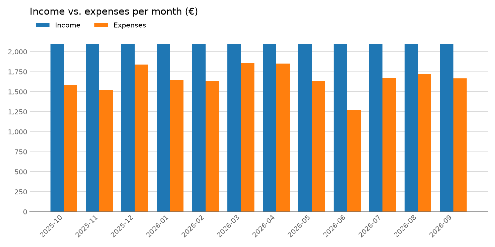
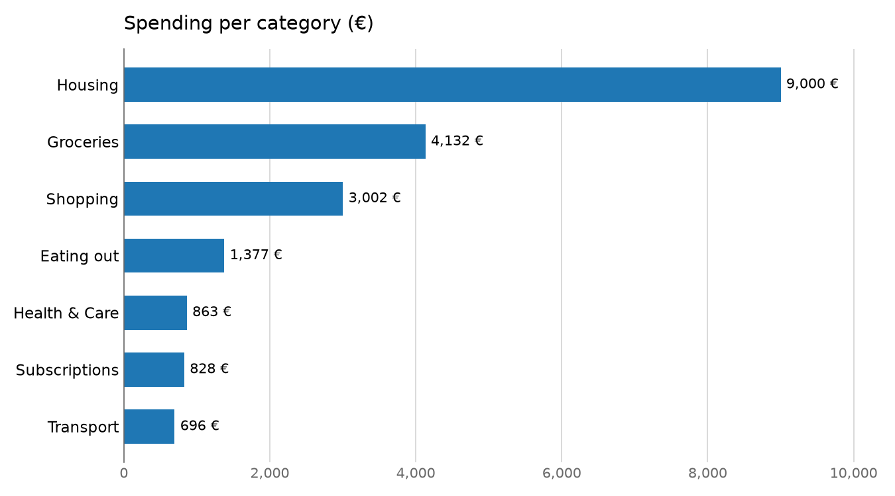
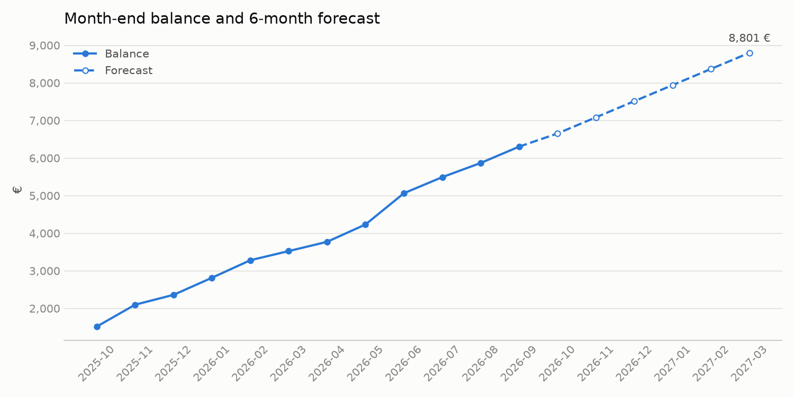

# Finance Analyzer

A command-line tool that reads your bank statement (CSV), shows where your
money goes, detects recurring payments like subscriptions, forecasts your
balance, and gives you written tips on how to save more.

It works out the layout of a bank statement by itself, so it can read files
from different banks. It also comes with realistic sample data, so you can
try it without using your own bank data.

## Features

- **Reads bank statements automatically**: finds the date, amount and description
  columns, and understands English and German dates and numbers
- **Monthly summary** of income, expenses, and savings
- **Automatic categories** (Groceries, Housing, Transfers, ...) based on the description
- **Recurring payment detection**: finds subscriptions, rent, and salary on its own,
  without being told their names
- **Price increases**: notices when a subscription got more expensive
- **Balance forecast** for the coming months using a linear trend
- **Saving tips** based on common rules of thumb (e.g. save 20% of your income,
  keep rent under 30%)
- **Charts** saved as PNG files
- **Sample data generator** for a full year of realistic transactions

## Installation

Requires Python 3.12 or newer. The commands below use [uv](https://docs.astral.sh/uv/).

```bash
git clone https://github.com/issamfarouk/finance-analyzer.git
cd finance-analyzer
uv sync
```

Alternatively, install it in editable mode into an existing environment:

```bash
uv pip install -e .
```

## Usage

Show all commands:

```bash
uv run -m finance_analyzer --help
```

The package also installs a `finance-analyzer` command, so this works too:

```bash
uv run finance-analyzer --help
```

### Analyze a bank statement

```bash
uv run -m finance_analyzer report data/sample_transactions.csv --balance 1000
```

| Argument | Meaning | Default |
|---|---|---|
| `file` | the bank statement CSV file | (required) |
| `--balance` | account balance before the first transaction | taken from the file if it has a balance column, otherwise `0` |
| `--months` | how many months to forecast | `6` |
| `--output` | folder for the report and charts | `output` |
| `--date-column` | name of the date column | found automatically |
| `--amount-column` | name of the amount column | found automatically |
| `--description-column` | name of the description column | found automatically |

The report is printed to the terminal and also saved as `output/report.txt`.
The three column options are only needed if the columns cannot be found automatically.

### Create sample data

```bash
uv run -m finance_analyzer generate
```

| Argument | Meaning | Default |
|---|---|---|
| `--output` | where to save the CSV file | `data/sample_transactions.csv` |
| `--months` | how many months of transactions | `12` |
| `--seed` | random seed (the same seed always gives the same data) | `42` |

## Example output

Running the `report` command on the included sample data prints
([full report](output/report.txt)):

```text
Tips
----
[Good]    Great job! You save 21% of your income.
[Warning] Housing takes 36% of your income (recommended: under 30%).
[Tip]     You have 5 recurring payments (Deutschlandticket, FitX Gym, Vodafone Mobile, Netflix, Spotify) costing 1,535.52 € per year. Cancel the ones you don't use.
[Info]    Price increase: Netflix went from 12.99 € to 13.99 € (12.00 € more per year).
[Tip]     You spend 250.19 € per month on Shopping. Cutting it by a quarter would save 750.58 € per year.
[Info]    2026-03 was your weakest month: you saved only 243.64 €. Check what happened there.
[Good]    Your balance covers 3.8 months of expenses. Nice safety net!
[Info]    Your balance grows by 429.02 € per month. In 6 months you could have 8,792.44 €.
```

and saves these charts to `output/`:







## Bank statement files

The program looks at the file and works out by itself:

- the **separator** (`,`, `;` or tab),
- which columns hold the **date**, the **amount** and the **description**, by their
  names (English or German), or by what is in them if the names are unknown,
- how **dates** are written (`2025-10-01`, `01.10.2025`, `01.10.25`, `01/10/2025`),
- how **numbers** are written (`1,234.56` or `1.234,56`).

If the file has a balance column, the starting balance is taken from it.
Negative amounts are money going out, positive amounts are money coming in.

Examples of files it reads (all in [`data/`](data/)):

```text
Date,Description,Amount
2025-10-01,Rent,-750.00
```

```text
Buchungstag;Verwendungszweck;Betrag
01.10.2025;Miete;-750,00
```

```text
Type,Product,Started Date,Completed Date,Description,Amount,Fee,Currency,State,Balance
Card Payment,Current,2025-10-02 18:40:11,2025-10-03 02:10:45,Lidl,-23.45,0.00,EUR,COMPLETED,576.55
```

The last one is a Revolut statement. For Revolut, cancelled payments are skipped and
the fee is subtracted from the amount. This was tested with a real Revolut statement.

Rows with a missing date or amount are skipped, and the report lists them with the reason.

## Example notebook

[`examples/demo.ipynb`](examples/demo.ipynb) shows how to use the package step by step,
with the tables and charts inside the notebook.

## Using it as a library

The most important parts are available directly from the package:

```python
from finance_analyzer import Account, find_recurring, forecast_balance, get_advice

account = Account.from_csv("data/sample_transactions.csv", starting_balance=1000)

print(f"{account.balance:,.2f} €")
print(account.monthly_summary())
print(account.spending_by_category())

for payment in find_recurring(account):
    print(payment)

print(forecast_balance(account, months=12))

for tip in get_advice(account):
    print(tip)
```

## How it works

| Module | What it does |
|---|---|
| `transaction.py` | `Transaction` class: one line of a bank statement |
| `importers.py` | `CsvImporter` works out the layout of a file; `RevolutImporter` adds the rules for Revolut |
| `account.py` | `Account` class: balance, monthly summary, and spending per category using pandas |
| `categorizer.py` | assigns a category by looking for keywords at the start of the words in the description |
| `recurring.py` | finds payments that repeat with about the same amount at regular intervals |
| `forecast.py` | fits a straight line through the month-end balances with NumPy and extends it |
| `advisor.py` | a list of small rules, each returning a tip or nothing |
| `plots.py` | draws the charts with matplotlib |
| `report.py` | combines everything into one text report |
| `generator.py` | creates realistic fake transactions |
| `__main__.py` | the command-line interface |

**Recurring payments:** transactions are grouped by description. A group counts
as recurring if it appears at least 3 times, its amount never differs by more
than 10% from the average, and the median gap between dates matches a weekly,
monthly, or yearly rhythm. If the latest payment costs more than the first one,
the price went up.

**Forecast:** the forecast assumes your habits stay the same. It cannot know
about future changes like a new job or a large one-time purchase.

## Development

Run the tests with [pytest](https://docs.pytest.org/):

```bash
uv run pytest
```

Check and format the code with [ruff](https://docs.astral.sh/ruff/):

```bash
uv run ruff check src tests
uv run ruff format src tests
```

## Author

**Mohamed Gomaa** ([@issamfarouk](https://github.com/issamfarouk))<br>
mohamed.gomaa@tu-dortmund.de

Final project for the course *Introduction in Python* at TU Dortmund.
